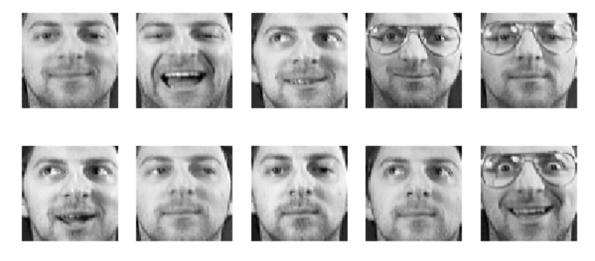

# Classification-Images
I hope to use a multi-task CNN to classify images of faces. Currently it's single task network, just identifying folks who have glasses.

The data I'm using is the Olvetti Faces data set by AT&T. More information and the data set itself are available from <a href="http://scikit-learn.org/stable/modules/generated/sklearn.datasets.fetch_olivetti_faces.html">scikit learn</a>. Briefly, this data set contains a total of 400 images of 40 different people; 10 photos of each person at various angles with different lighting and facial expressions.

 

Some people are wearing glasses in some of their 10 photos, like the guy pictured above. 

Some people are wearing glasses in all of their 10 photos. 

And some people, yup... you guesses it, are not wearing glasses in any of their photos.

The goal is to get a functional version, as opposed to sequential version, of the CNN in order to have dual outputs. One output for identity (1 through 40) and one output for glasses (0, 1). And maybe compare performance with SVM? 
Still a work in progress :)
